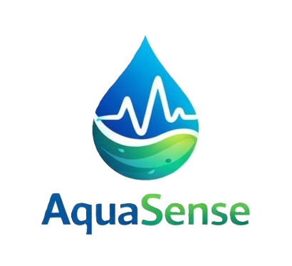
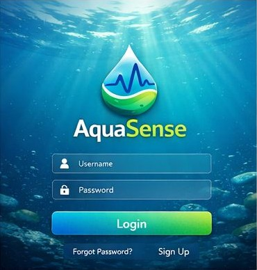
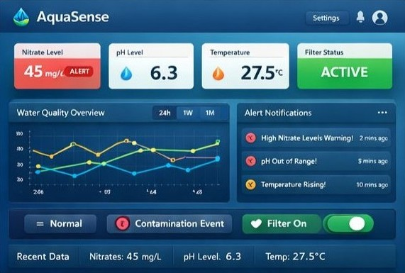

# 🚀 AquaSense

  

  <b>Smart Water Quality Monitoring, Simulation & Automation Platform</b>

---

## 🧠 About the Project

AquaSense is a web-based SaaS platform designed to simulate, monitor, and automate water treatment systems in a realistic and interactive way.

It integrates real-time data visualization, system simulation, automation logic, and chemical dosing control — providing a near real-world industrial experience.

---

## 🌊 Key Features

- 📊 Real-time monitoring of water parameters  
- 🚨 Smart alert system based on thresholds  
- ⚙️ Equipment control (valves, pumps, filters)  
- 🤖 Automated process response  
- 🧪 Chemical dosing management  
- 📈 Historical data visualization  
- 🔄 Dynamic simulation engine  

---

## 🖼️ Application Preview

### 🔐 Login Screen

  

---

### 📊 Dashboard

  

---

## 🏗️ Architecture

Python (Simulation & Automation)
↓
Backend (Spring Boot)
↓
Frontend (React)

---

## 🧩 System Components

### 🖥️ Frontend (React)
- Interactive dashboard  
- Real-time charts  
- Alerts visualization  
- Control panel (manual / automatic modes)  

---

### 🔧 Backend (Spring Boot)
- REST API  
- Business logic  
- Data persistence  
- Alert processing  
- Command validation  

---

### 🐍 Python Engine
- System simulation  
- Automation logic  
- Event generation  
- Chemical process simulation  

---

## ⚙️ API Endpoints

| Endpoint      | Description                |
|--------------|--------------------------|
| `/estado`     | Current system state      |
| `/historico`  | Historical data           |
| `/alertas`    | Alerts list               |
| `/control`    | Send control commands     |
| `/equipos`    | Equipment status          |
| `/quimicos`   | Chemical dosing data      |

---

## 🤖 Automation Examples

- pH too low → dose alkaline chemical  
- Tank level too high → close inlet valve  
- Low chlorine → increase dosing  
- Sensor failure → trigger alert  

---

## 🧪 Chemicals Supported

- Acids (Sulfuric, HCl, CO₂)  
- Bases (NaOH, Lime, Carbonates)  
- Coagulants (Ferric Chloride, PAC)  
- Flocculants (Polymers)  
- Disinfectants (Chlorine, Peroxide, Ozone)  

---

## 📡 Sensors

- pH  
- Temperature  
- Flow  
- Level  
- Conductivity  
- Turbidity  
- Dissolved Oxygen  
- ORP (Redox)  
- Chlorine  

---

## 🧠 Operation Modes

- 🔧 Manual Mode  
- 🤖 Automatic Mode  
- 🛡️ Safe Mode  

---

## 📂 Project Structure

/project
/frontend
/backend
/python
/assets
README.md

---

## 🛠️ Tech Stack

- Frontend: React  
- Backend: Spring Boot (Java)  
- Simulation: Python  
- Communication: REST API  

---

## 🚀 Getting Started

### 1. Clone the repository

git clone https://github.com/your-repo/aquasense.git

### 2. Run Backend

cd backend
./mvnw spring-boot:run

### 3. Run Frontend

cd frontend
npm install
npm start

### 4. Run Python Engine

cd python
python main.py

---

## 🧑‍💻 Team Roles

- Frontend → UI & user interaction  
- Backend → API & system logic  
- Python → simulation & automation  

---

## 🎯 Project Goal

To build a realistic and interactive platform that simulates industrial water treatment systems, enabling monitoring, control, and automation in a unified environment.

---

## 📌 Future Improvements

- WebSocket real-time updates  
- AI-based anomaly detection  
- Integration with real sensors (IoT)  
- Mobile version  

---

## 📄 License

This project is for educational and demonstration purposes.
